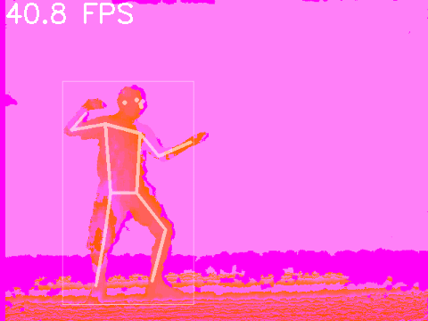

# XPOSE: Where Vision Meets Precision

## Project Description:
XPOSE stands at the forefront of human pose estimation, setting a new standard for precision and efficiency. It represents a state-of-the-art, efficient single-stage method that excels at estimating the poses of multiple individuals within complex scenes. XPOSE adopts a groundbreaking approach by modeling both keypoints and poses as distinct objects, meticulously analyzed within a dense anchor-based detection framework.

Xpose stands as one of my advanced projects, representing the culmination of expertise and innovation in computer vision. It is a cutting-edge human pose estimation project that combines the power of PyTorch and YOLOv5 (You Only Look Once version 5) for object detection. Xpose is meticulously designed to accurately and efficiently detect and predict the positions of key body keypoints in images.

## Key Features:

### Multi-Variant Precision: Xpose offers three distinct variants, each tailored to specific requirements, reflecting the depth of expertise behind this project:

#### Xpose Lite (xpose-l)

#### Xpose Pro (xpose-p)

#### Xpose Max (xpose-m)

#### State-of-the-Art Architecture: All variants of Xpose are built on state-of-the-art neural network architectures specifically designed for human pose estimation using PyTorch. These architectures have been fine-tuned and optimized to provide exceptional results.

#### YOLOv5 Integration: Xpose integrates YOLOv5 (You Only Look Once version 5) for object detection, allowing for efficient and accurate detection of human keypoints within the context of the entire image.

#### Efficient Training: Xpose models are trained efficiently using PyTorch and YOLOv5, with carefully chosen hyperparameters and data augmentation techniques.


When not using test-time augmentation (TTA), XPOSE is much faster and more accurate than 
previous single-stage methods like 
[DEKR](https://github.com/HRNet/DEKR), 
[HigherHRNet](https://github.com/HRNet/HigherHRNet-Human-Pose-Estimation),
[HigherHRNet + SWAHR](https://github.com/greatlog/SWAHR-HumanPose), and
[CenterGroup](https://github.com/dvl-tum/center-group):


### Setup
1. If you haven't already, [install Anaconda or Miniconda](https://docs.conda.io/projects/conda/en/latest/user-guide/install/index.html).
2. Create a new conda environment with Python 3.6: `$ conda create -n xpose python=3.6`.
3. Activate the environment: `$ conda activate xpose`
4. Clone this repo: `$ git clone https://github.com/Malav5372/xpose.git`
5. Install the dependencies: `$ cd xpose && pip install -r requirements.txt`
6. Download the trained models: `$ python data/scripts/download_models.py`

## Inference Demos

**Note:** FPS calculations include **all processing** (i.e., including image loading, resizing, inference, plotting / tracking, etc.).
See script arguments for inference options.

---

#### Static Image

To generate the four images in the GIF above:
1. `$ python demos/image.py --bbox`
2. `$ python demos/image.py --bbox --pose --face --no-kp-dets`
3. `$ python demos/image.py --bbox --pose --face --no-kp-dets --kp-bbox`
4. `$ python demos/image.py --pose --face`

#### Shuffling Video
XPOSE runs fastest on low resolution video with few people in the frame. This demo runs XPOSE-L on a single-person 480p dance video using an input size of 1024. 
The inference speed is **~9.5 FPS** on the CPU, and **~60 FPS** on the TITAN Xp.

**CPU inference:**<br>
<br>

To display the results in real-time: <br> 
`$ python demos/video.py --face --display`

To create the GIF above:<br>
`$ python demos/video.py --face --device cpu --gif`

---

#### Flash Mob Video
This demo runs XPOSE-L on a 720p flash mob video using an input size of 1280.

**GPU inference:**<br>
<br>

To display the results in real-time: <br> 
`$ python demos/video.py --yt-id 2DiQUX11YaY --tag 136 --imgsz 1280 --color 255 0 255 --start 188 --end 196 --display`

To create the GIF above:<br>
`$ python demos/video.py --yt-id 2DiQUX11YaY --tag 136 --imgsz 1280 --color 255 0 255 --start 188 --end 196 --gif`

---

#### Red Light Green Light
This demo runs XPOSE-M on a 480p clip from the TV show _Squid Game_ using an input size of 1024.
The plotted poses constitute keypoint objects only.

**GPU inference:**<br>
<br>

To display the results in real-time:<br>
`$ python demos/video.py --yt-id nrchfeybHmw --imgsz 1024 --weights xpose_m_coco.pt --conf-thres-kp 0.01 --kp-obj --face --start 56 --end 72 --display`

To create the GIF above:<br>
`$ python demos/video.py --yt-id nrchfeybHmw --imgsz 1024 --weights xpose_m_coco.pt --conf-thres-kp 0.01 --kp-obj --face --start 56 --end 72 --gif`

---

#### Squash Video
This demo runs XPOSE-L on a 1080p slow motion squash video. It uses a simple player tracking algorithm based on the frame-to-frame pose differences.

**GPU inference:**<br>
<br>

To display the inference results in real-time: <br> 
`$ python demos/squash.py --display --fps`

To create the GIF above:<br>
`$ python demos/squash.py --start 42 --end 50 --gif --fps`

---

#### Depth Video
Pose objects generalize well and can even be detected in depth video. 
Here XPOSE-L was run on a depth video from a [fencing action recognition dataset](https://ieeexplore.ieee.org/abstract/document/8076041?casa_token=Zvm7dLIr1rYAAAAA:KrqtVl3NXrJZn05Eb4KGMio-18VPHc3uyDJZSiNJyI7f7oHQ5V2iwB7bK4mCJCmN83NrRl4P). 

<br>

The depth video above can be downloaded directly from [here](https://drive.google.com/file/d/1n4so5WN6snyCYxeUk4xX1glADqQuitXP/view?usp=sharing).
To create the GIF above:<br>
`$ python demos/video.py -p 2016-01-04_21-33-35_Depth.avi --face --start 0 --end -1 --gif --gif-size 480 360`

---

## Understanding the terms AP and TTA

### Average Precision (AP):

Average Precision, often abbreviated as "AP," is a critical metric in the field of computer vision and object detection. It serves as a measure of the accuracy and reliability of detection models, including XPOSE. AP evaluates how well a model correctly identifies and localizes objects of interest within images.

In the context of XPOSE, a higher AP score signifies superior performance. It indicates that our method excels at not only detecting human poses and keypoints but also precisely localizing them within images. AP is a valuable benchmark that reflects the precision and robustness of our technology, ensuring that it delivers dependable results.

### Test-Time Augmentation (TTA):

Test-Time Augmentation, abbreviated as TTA, is a technique used in computer vision and deep learning to improve the robustness and accuracy of machine learning models during the inference or testing phase. TTA achieves this by applying a set of data transformations and augmentations to input images just before making predictions.

Instead of relying on a single version of an input image, TTA creates multiple variations of that image by applying transformations such as rotations, flips, cropping, and color adjustments. These augmented versions provide the model with different perspectives and variations of the same data, effectively increasing the diversity of the input.

During prediction, the model generates results for each augmented version of the input image. These individual predictions are then typically combined in some way, such as averaging or voting, to produce a final prediction. By considering multiple perspectives of the same input data, TTA helps the model become more robust to variations in lighting, orientation, and other factors, ultimately leading to more accurate and reliable predictions.

## COCO Experiments
Download the COCO dataset:  `$ sh data/scripts/get_coco_kp.sh`

### Validation (without TTA)
- XPOSE-L (63.0 AP): `$ python val.py --rect`
- XPOSE-P (68.5 AP): `$ python val.py --rect --weights xpose_p_coco.pt`
- XPOSE-M (70.6 AP): `$ python val.py --rect --weights xpose_m_coco.pt`

### Validation (with TTA)
- XPOSE-L (64.3 AP): `$ python val.py --scales 0.8 1 1.2 --flips -1 3 -1`
- XPOSE-P (69.6 AP): `$ python val.py --weights xpose_p_coco.pt \ `<br>
`--scales 0.8 1 1.2 --flips -1 3 -1` 
- XPOSE-M (71.6 AP): `$ python val.py --weights xpose_m_coco.pt \ `<br>
`--scales 0.8 1 1.2 --flips -1 3 -1` 

### Testing
- XPOSE-L (63.8 AP): `$ python val.py --scales 0.8 1 1.2 --flips -1 3 -1 --task test` 
- XPOSE-P (68.8 AP): `$ python val.py --weights xpose_p_coco.pt \ `<br>
`--scales 0.8 1 1.2 --flips -1 3 -1 --task test` 
- XPOSE-M (70.3 AP): `$ python val.py --weights xpose_m_coco.pt \ `<br>
`--scales 0.8 1 1.2 --flips -1 3 -1 --task test` 


### Training
The following commands were used to train the XPOSE models on 4 V100s with 32GB memory each.

XPOSE-L:
```
python -m torch.distributed.launch --nproc_per_node 4 train.py \
--img 1280 \
--batch 128 \
--epochs 500 \
--data data/coco-kp.yaml \
--hyp data/hyps/hyp.kp-p6.yaml \
--val-scales 1 \
--val-flips -1 \
--weights yolov5s6.pt \
--project runs/s_e500 \
--name train \
--workers 128
```

XPOSE-P:
```
python train.py \
--img 1280 \
--batch 72 \
--epochs 500 \
--data data/coco-kp.yaml \
--hyp data/hyps/hyp.kp-p6.yaml \
--val-scales 1 \
--val-flips -1 \
--weights yolov5m6.pt \
--project runs/m_e500 \
--name train \
--workers 128
```

XPOSE-M:
```
python train.py \
--img 1280 \
--batch 48 \
--epochs 500 \
--data data/coco-kp.yaml \
--hyp data/hyps/hyp.kp-p6.yaml \
--val-scales 1 \
--val-flips -1 \
--weights yolov5l6.pt \
--project runs/l_e500 \
--name train \
--workers 128
```

**Note:** [DDP](https://pytorch.org/tutorials/intermediate/ddp_tutorial.html) is usually recommended but we found training was less stable for XPOSE-P/M using DDP. We are investigating this issue.

## CrowdPose Experiments
- Install the [CrowdPose API](https://github.com/Jeff-sjtu/CrowdPose/tree/master/crowdpose-api) to your conda environment: <br>
`$ cd .. && git clone https://github.com/Jeff-sjtu/CrowdPose.git` <br>
`$ cd CrowdPose/crowdpose-api/PythonAPI && sh install.sh && cd ../../../xpose`
- Download the CrowdPose dataset:  `$ sh data/scripts/get_crowdpose.sh`

### Testing
- XPOSE-L (63.8 AP): `$ python val.py --data crowdpose.yaml \ `<br>
`--weights xpose_l_crowdpose.pt --scales 0.8 1 1.2 --flips -1 3 -1` 
- XPOSE-P (67.1 AP): `$ python val.py --data crowdpose.yaml \ `<br>
`--weights xpose_p_crowdpose.pt --scales 0.8 1 1.2 --flips -1 3 -1`
- XPOSE-M (68.9 AP): `$ python val.py --data crowdpose.yaml \ `<br>
`--weights xpose_m_crowdpose.pt --scales 0.8 1 1.2 --flips -1 3 -1`

### Training
The following commands were used to train the XPOSE models on 4 V100s with 32GB memory each. 
Training was performed on the `trainval` split with no validation. 
The test results above were generated using the last model checkpoint.

XPOSE-L:
```
python -m torch.distributed.launch --nproc_per_node 4 train.py \
--img 1280 \
--batch 128 \
--epochs 300 \
--data data/crowdpose.yaml \
--hyp data/hyps/hyp.kp-p6.yaml \
--val-scales 1 \
--val-flips -1 \
--weights yolov5s6.pt \
--project runs/cp_s_e300 \
--name train \
--workers 128 \
--noval
```
XPOSE-P:
```
python train.py \
--img 1280 \
--batch 72 \
--epochs 300 \
--data data/crowdpose.yaml \
--hyp data/hyps/hyp.kp-p6.yaml \
--val-scales 1 \
--val-flips -1 \
--weights yolov5m6.pt \
--project runs/cp_m_e300 \
--name train \
--workers 128 \
--noval
```
XPOSE-M:
```
python train.py \
--img 1280 \
--batch 48 \
--epochs 300 \
--data data/crowdpose.yaml \
--hyp data/hyps/hyp.kp-p6.yaml \
--val-scales 1 \
--val-flips -1 \
--weights yolov5l6.pt \
--project runs/cp_l_e300 \
--name train \
--workers 128 \
--noval
```
